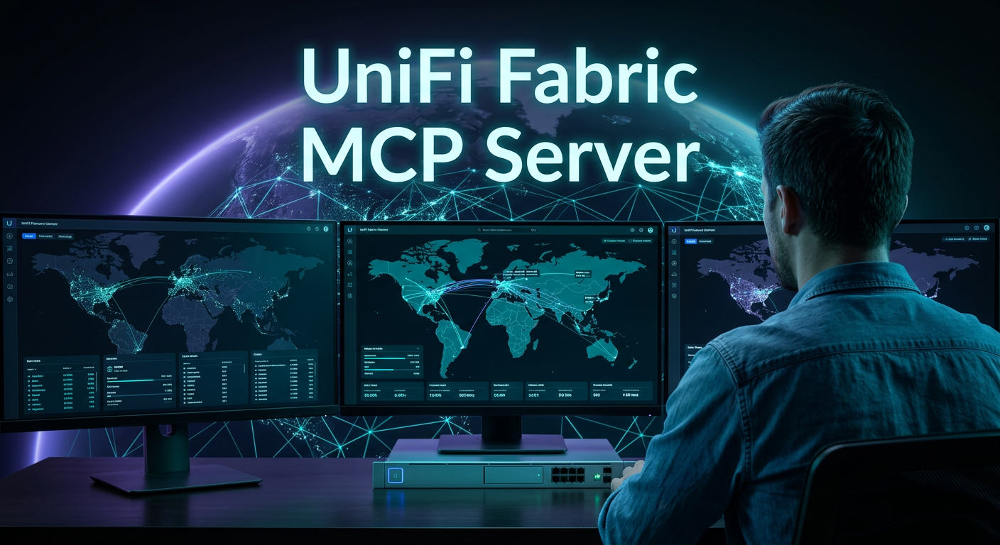
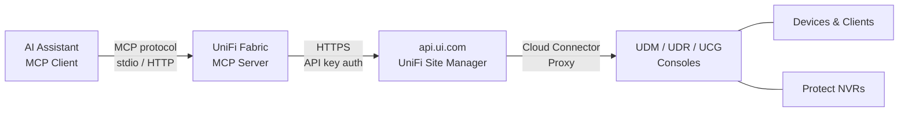

# UniFi Fabric MCP Server

[](https://github.com/swkstudios/unifi-fabric-mcp-server/actions/workflows/ci.yml)
[](https://www.python.org/)
[](https://opensource.org/licenses/MIT)

> **Cloud-first UniFi management for AI agents.** This server connects to the official UniFi Site Manager / Fabric cloud API (`api.ui.com`) — no direct controller access, SSH, or local network access required. Manage your entire UniFi fleet from anywhere through natural language.

An MCP (Model Context Protocol) server that exposes the UniFi Site Manager API as tools for AI assistants. Built with [FastMCP](https://github.com/PrefectHQ/fastmcp), it lets Claude Code, Cline, and other MCP clients manage UniFi network infrastructure through natural language.

> **Disclaimer:** This project is not affiliated with, endorsed by, or sponsored by Ubiquiti Inc. UniFi is a trademark of Ubiquiti Inc.

## Architecture



## What is MCP?

**Model Context Protocol (MCP)** is an open standard that enables large language models (LLMs) and AI assistants to securely interact with external systems and tools. Instead of asking the AI to make manual API calls or describe steps, MCP allows the AI to:

- Execute commands and operations directly in external systems
- Query data and retrieve real-time information
- Automate complex workflows through natural conversation

This UniFi Fabric MCP server bridges UniFi's network management API with AI assistants, enabling you to control your network infrastructure through conversation.

## Use Cases

- **Network Operations**: Monitor fleet health, manage sites, and troubleshoot devices using natural language
- **Security Management**: Create and update firewall policies, manage ACLs, and configure DNS policies without manual API calls
- **MSP Operations**: Manage multiple UniFi consoles and organizations with a single AI interface
- **Device Management**: Monitor and control cameras, sensors, and other Protect devices across your infrastructure
- **Automation**: Build AI-powered workflows for routine network tasks and compliance audits

## Quick Start

### Get Your API Key

1. Sign in to [UniFi Site Manager](https://unifi.ui.com) with your Ubiquiti account
2. Select your organization from the dropdown (top-left)
3. In the left sidebar, click **API Keys**
4. Click **Create New API Key** and give it a descriptive name
5. Select the **API Scope** — enable **Site Manager** and **Network** at minimum (add **Protect** if managing cameras)
6. Under **Sites**, choose which sites the key can access (or select all)
7. Copy the key immediately — it won't be shown again

> **Note:** These are UniFi Site Manager API keys that authenticate against the cloud API (`api.ui.com`). Your consoles must be adopted to your UI.com account and connected to Ubiquiti's cloud for the key to discover them. See the [API Docs](https://developer.ui.com) for more details.

---

### Track A — Local (stdio)

Install and run the server locally. The MCP client launches it as a subprocess over stdio.

**Requires Python 3.12+**

```bash
git clone https://github.com/swkstudios/unifi-fabric-mcp-server.git
cd unifi-fabric-mcp-server
python3 -m venv .venv && source .venv/bin/activate
pip install -e .
export UNIFI_API_KEY="your-api-key-here"
unifi-fabric-mcp
```

Add to `~/.claude/settings.json` or project `.mcp.json`:

```json
{
  "mcpServers": {
    "unifi-fabric": {
      "command": "unifi-fabric-mcp",
      "env": { "UNIFI_API_KEY": "your-api-key-here" }
    }
  }
}
```

---

### Track B — Docker (HTTP, Recommended)

Run the server as a container. The MCP client connects over HTTP to the `/mcp` endpoint.

```bash
docker run -e UNIFI_API_KEY="your-api-key-here" -p 3000:3000 ghcr.io/swkstudios/unifi-fabric-mcp-server
```

Add to `~/.claude/settings.json` or project `.mcp.json`:

```json
{
  "mcpServers": {
    "unifi-fabric": {
      "type": "http",
      "url": "http://localhost:3000/mcp"
    }
  }
}
```

See [`config/mcp-server.example.json`](config/mcp-server.example.json) for a full example.

> **Network deployments:** The MCP server listens on plain HTTP. For non-localhost deployments, run behind a TLS-terminating reverse proxy (e.g., Traefik, Caddy, nginx).

---

## Example Prompts

Copy-paste these into Claude Code or any MCP client after connecting:

```
Show me a summary of all devices and clients across my sites.
```

```
Are there any offline devices? List them with their site names.
```

```
Create a firewall policy that blocks traffic from the guest VLAN to the server VLAN.
```

```
List all firewall policies and show their current ordering.
```

```
Get the RTSPS stream URLs for cameras in the main office.
```

```
How many clients are connected to each site right now?
```

### Sample Tool Output

When you ask the MCP server a question, it executes tools and returns structured data. Here's an example of a fleet summary:

```json
{
  "total_consoles": 3,
  "total_sites": 7,
  "total_devices": 42,
  "total_clients": 157,
  "device_status": {
    "online": 38,
    "offline": 3,
    "adopting": 1
  },
  "sites": [
    {
      "site_name": "Main Office",
      "device_count": 12,
      "client_count": 65,
      "health": "good"
    },
    {
      "site_name": "Branch 1",
      "device_count": 15,
      "client_count": 52,
      "health": "good"
    },
    {
      "site_name": "Branch 2",
      "device_count": 10,
      "client_count": 40,
      "health": "degraded"
    }
  ]
}
```

## Compatibility

This server integrates with the following UniFi components:

| Component | Minimum Version | Tested Version | Tested OS |
|-----------|-----------------|----------------|-----------|
| Site Manager API | — | v1.0 | N/A |
| Network | v10.0.0 | v10.1.84+ | — |
| Protect | v7.0.0 | v7.0.104+ | — |
| UDM Pro / UDR Hardware | — | — | OS 5.1.7 / Network 10.3.55 / Protect 7.0.107 |

For the latest component versions and hardware compatibility, see [developer.ui.com](https://developer.ui.com).

## Available Tools

The server exposes **168+ tools** organized by domain for managing UniFi infrastructure:

| Domain | Tool Count | Purpose |
|--------|-----------|---------|
| **Fleet & Aggregation** | 6 | Cross-console device search, fleet summary, site comparison |
| **Site Management** | 8 | Site operations, health, inventory, system info |
| **Network & VLAN** | 18 | Networks, VLANs, WiFi broadcasts, WAN interfaces |
| **Device Management** | 16 | Device control, adoption, stats, actions, location |
| **Clients** | 8 | Client listing, stats, blocking, reconnection |
| **Firewall** | 24 | Policies, zones, ACL rules, rule ordering |
| **DNS & Traffic** | 21 | DNS policies, traffic rules, matching lists, routes |
| **Port Forwarding** | 4 | List, create, update, delete port forwards |
| **WLAN** | 6 | WLAN configs, groups, security settings |
| **Protect** | 22 | Cameras, sensors, lights, chimes, liveviews, PTZ, snapshots |
| **VPN** | 12 | VPN servers, site-to-site tunnels, RADIUS profiles |
| **Hotspot** | 4 | Voucher management, operators, billing packages |
| **Settings & Monitoring** | 8 | Controller settings, ISP metrics, WAN health |
| **Utilities** | 7 | Country list, file upload, alarm webhooks |
| **Other** | 4 | Miscellaneous network operations |

For the authoritative tool list, MCP clients can query the server directly or see `src/unifi_fabric/server.py` for all `@mcp.tool()` definitions.

## Configuration

### UniFi API Settings

All UniFi-specific settings are loaded from environment variables with the `UNIFI_` prefix.

| Variable | Required | Default | Description |
|---|---|---|---|
| `UNIFI_API_KEY` | Yes (if `UNIFI_API_KEYS` not set) | — | Single API key shorthand |
| `UNIFI_API_KEYS` | No | — | JSON list of key configs for multi-console MSP setups |
| `UNIFI_API_BASE_URL` | No | `https://api.ui.com` | UniFi Site Manager API base URL |
| `UNIFI_CACHE_TTL_SECONDS` | No | `900` | TTL for host/site registry cache (seconds) |
| `UNIFI_CACHE_MAX_HOSTS` | No | `512` | Max entries in the hosts/sites TTLCache (bounds memory use) |
| `UNIFI_CACHE_MAX_SITES` | No | `2048` | Max entries in the per-console sites TTLCache |
| `UNIFI_MAX_CONCURRENCY` | No | `10` | Max concurrent outbound requests to api.ui.com |
| `UNIFI_REQUEST_TIMEOUT_SECONDS` | No | `30` | HTTP request timeout in seconds |
| `UNIFI_PAGINATE_MAX_PAGES` | No | `None` (unlimited) | Hard cap on pagination page count. Unset by default — stall detection is the primary safeguard. Set to a generous number (e.g. `100000`) if desired. |

### Transport Configuration

The MCP server communicates with clients using the FastMCP transport protocol. By default, the Docker image uses `streamable-http`, but you can override this for different deployment scenarios.

**`FASTMCP_TRANSPORT`**: Sets the communication protocol between the MCP server and clients.

| Transport | Use Case | Port | Notes |
|---|---|---|---|
| `streamable-http` | Docker containers, HTTP load balancers, reverse proxies | `3000` | Default; recommended for containerized deployments |
| `sse` | Server-sent events; browser clients, long-polling scenarios | `3000` | Stateful, requires connection persistence |
| `stdio` | Process-to-process communication, local development | — | No network port; requires parent process stdin/stdout |

#### Override Transport via Docker

To use a different transport, override the environment variable at runtime:

```bash
# SSE transport
docker run -e UNIFI_API_KEY="your-api-key-here" -e FASTMCP_TRANSPORT=sse -p 3000:3000 ghcr.io/swkstudios/unifi-fabric-mcp-server

# Stdio transport
docker run -e UNIFI_API_KEY="your-api-key-here" -e FASTMCP_TRANSPORT=stdio ghcr.io/swkstudios/unifi-fabric-mcp-server
```

#### Override Transport in Docker Compose

```yaml
services:
  unifi-fabric-mcp:
    image: ghcr.io/swkstudios/unifi-fabric-mcp-server
    environment:
      UNIFI_API_KEY: your-api-key-here
      FASTMCP_TRANSPORT: sse  # or stdio
    ports:
      - "3000:3000"
```

**Note:** The server exposes port 3000 for `streamable-http` and `sse` transports. If using `stdio`, no port is exposed; the server communicates exclusively via stdin/stdout.

### Single key setup

```bash
export UNIFI_API_KEY="your-api-key-here"
```

### Multi-key MSP setup

```bash
export UNIFI_API_KEYS='[{"key": "key-a", "label": "org-east", "is_org_key": true}, {"key": "key-b", "label": "org-west"}]'
```

Organization keys (`is_org_key: true`) cover all sites under the org. Personal keys only access consoles owned by the key holder.


## Development

```bash
# Install dev dependencies
pip install -e ".[dev]"

# Run tests
pytest

# Lint
ruff check src/ tests/
ruff format --check src/ tests/
```

## Docker Deployment

The server ships as a Docker image. When pinning deployments for production use,
reference the image by digest rather than a mutable tag to ensure reproducibility
and guard against tag mutation:

```bash
# Pull by digest instead of :latest or a version tag
docker pull ghcr.io/swkstudios/unifi-fabric-mcp-server@sha256:<digest>
```

You can find the digest for a given release on the package page or via:

```bash
docker inspect --format='{{index .RepoDigests 0}}' ghcr.io/swkstudios/unifi-fabric-mcp-server:latest
```

### Stateless Design (No Persistent Volumes)

**By design, this container is stateless and does not require persistent volumes.** The MCP server:

- Makes API calls to the remote UniFi Site Manager cloud API (`api.ui.com`)
- Does not maintain local state between requests
- Does not store credentials, configurations, or cached data on disk
- Uses in-memory caching only (with configurable TTL, default 900 seconds)
- Has no dependencies on local storage, databases, or filesystem persistence

**Why stateless?** The server acts as an ephemeral proxy/bridge between AI assistants and the UniFi cloud API. Each session is independent; all configuration and data live in the cloud. Deployment is simplified by container orchestrators (Docker Compose, Kubernetes) with no persistent volume claims needed.

**Implications:**
- Cache is reset on container restart (this is safe and expected)
- Multiple server instances can run in parallel without coordination
- No data loss risk from container updates or replacements
- Scaling is stateless and simple

## Contributing

See [CONTRIBUTING.md](CONTRIBUTING.md) for branch naming conventions, commit style, and PR requirements.

See [SECURITY.md](.github/SECURITY.md) for how to report vulnerabilities privately.

## License

MIT. See [LICENSE](LICENSE) for details.


