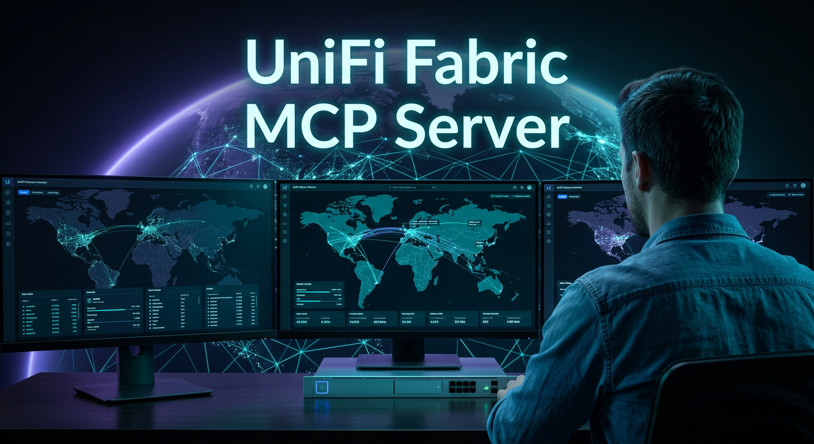
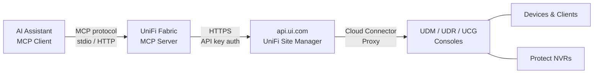

# UniFi Fabric MCP Server

[](https://github.com/swkstudios/unifi-fabric-mcp-server/actions/workflows/ci.yml)
[](https://www.python.org/)
[](https://opensource.org/licenses/MIT)

> **Cloud-first UniFi management for AI agents.** This server connects to the official UniFi Site Manager / Fabric cloud API (`api.ui.com`) — no direct controller access, SSH, or local network access required. Manage your entire UniFi fleet from anywhere through natural language.

An MCP (Model Context Protocol) server that exposes the UniFi Site Manager API as tools for AI assistants. Built with [FastMCP](https://github.com/PrefectHQ/fastmcp), it lets Claude Code, Cline, and other MCP clients manage UniFi network infrastructure through natural language.

> **Disclaimer:** This project is not affiliated with, endorsed by, or sponsored by Ubiquiti Inc. UniFi is a trademark of Ubiquiti Inc.

**Highlights:**

- 208 tools across Fleet, Network, Firewall, Protect, VPN, InnerSpace, History, and more
- Faithful pass-through — tools return complete upstream payloads including credential fields (WLAN passphrases, RADIUS secrets, API tokens), GPS coordinates, and Protect recognition data. The `include_secrets` and `include_gps` parameters have been removed; all fields are always returned. Callers upgrading from 0.4.x or earlier should drop those parameters.
- Configurable authentication: `none` (loopback/dev) / `bearer` (LAN/VPN) / `oauth` (resource-server, JWT-verified via JWKS)
- Configurable TLS: plain HTTP / in-server HTTPS (`https`) / mutual TLS (`mtls`)
- Stdio transport for local use; `streamable-http` / `sse` for containerized deployments
- Stateless, cloud-first design — connects to `api.ui.com` via the UniFi Site Manager API; no direct controller access required


## Architecture


```mermaid
flowchart LR
    A[AI Assistant<br/>MCP Client] -->|MCP protocol<br/>stdio / HTTP| B[UniFi Fabric<br/>MCP Server]
    B -->|HTTPS<br/>API key auth| C[api.ui.com<br/>UniFi Site Manager]
    C -->|Cloud Connector<br/>Proxy| D[UDM / UDR / UCG<br/>Consoles]
    D --- E[Devices & Clients]
    D --- F[Protect NVRs]
```

## What is MCP?

**Model Context Protocol (MCP)** is an open standard that enables large language models (LLMs) and AI assistants to securely interact with external systems and tools. Instead of asking the AI to make manual API calls or describe steps, MCP allows the AI to:

- Execute commands and operations directly in external systems
- Query data and retrieve real-time information
- Automate complex workflows through natural conversation

This UniFi Fabric MCP server bridges UniFi's network management API with AI assistants, enabling you to control your network infrastructure through conversation.

## Use Cases

- **Network Operations**: Monitor fleet health, manage sites, and troubleshoot devices using natural language
- **Security Management**: Create and update firewall policies, manage ACLs, and configure DNS policies without manual API calls
- **MSP Operations**: Manage multiple UniFi consoles and organizations with a single AI interface
- **Device Management**: Monitor and control cameras, sensors, and other Protect devices across your infrastructure
- **Automation**: Build AI-powered workflows for routine network tasks and compliance audits

## Quick Start

### Get Your API Key

1. Sign in to [UniFi Site Manager](https://unifi.ui.com) with your Ubiquiti account
2. Select your organization from the dropdown (top-left)
3. In the left sidebar, click **API Keys**
4. Click **Create New API Key** and give it a descriptive name
5. Select the **API Scope** — enable **Site Manager** and **Network** at minimum (add **Protect** if managing cameras)
6. Under **Sites**, choose which sites the key can access (or select all)
7. Copy the key immediately — it won't be shown again

> **Note:** These are UniFi Site Manager API keys that authenticate against the cloud API (`api.ui.com`). Your consoles must be adopted to your UI.com account and connected to Ubiquiti's cloud for the key to discover them. See the [API Docs](https://developer.ui.com) for more details.

---

### Track A — Local (stdio)

Install and run the server locally. The MCP client launches it as a subprocess over stdio.

**Requires Python 3.12+**

```bash
git clone https://github.com/swkstudios/unifi-fabric-mcp-server.git
cd unifi-fabric-mcp-server
python3 -m venv .venv && source .venv/bin/activate
pip install -e .          # -e is editable/dev mode; omit for a standard install
export UNIFI_API_KEY="your-api-key-here"
unifi-fabric-mcp
```

Add to `~/.claude/settings.json` or project `.mcp.json`:

```json
{
  "mcpServers": {
    "unifi-fabric": {
      "command": "unifi-fabric-mcp",
      "env": { "UNIFI_API_KEY": "your-api-key-here" }
    }
  }
}
```

> **PATH note:** The `"command": "unifi-fabric-mcp"` entry point only resolves if it is on the MCP client's `PATH`. Many MCP clients do not inherit the shell's virtual environment. Use the absolute path to the venv binary instead (e.g. `/path/to/.venv/bin/unifi-fabric-mcp`), or install globally with `pipx install .` or `uv tool install .`.

**Verify it works:** When launched by the client the server exits immediately if `UNIFI_API_KEY` is absent or empty; an incorrect key will not prevent startup but will cause tool calls to fail with an authentication error. A successful start produces no output on stdio (the client communicates over stdin/stdout).

---

### Track B — Docker (HTTP, Recommended)

Run the server as a container. The MCP client connects over HTTP to the `/mcp` endpoint.

```bash
docker run -e UNIFI_API_KEY="your-api-key-here" -p 3000:3000 ghcr.io/swkstudios/unifi-fabric-mcp-server:0.5.0
```

> **Tip:** `:0.5.0` pins to this release. `:latest` always tracks the newest **published** image — it is not the current development state and may not include tools added since the last release. For production deployments, pin by digest instead — see [Docker Deployment](#docker-deployment).

Add to `~/.claude/settings.json` or project `.mcp.json`:

```json
{
  "mcpServers": {
    "unifi-fabric": {
      "type": "http",
      "url": "http://localhost:3000/mcp"
    }
  }
}
```

**Verify it works:**

```bash
curl -s -w "\nHTTP:%{http_code}\n" \
  -X POST -H "Content-Type: application/json" \
  -H "Accept: application/json, text/event-stream" \
  -d '{"jsonrpc":"2.0","id":1,"method":"initialize","params":{"protocolVersion":"2024-11-05","capabilities":{},"clientInfo":{"name":"test","version":"0.1.0"}}}' \
  http://localhost:3000/mcp
```

`HTTP:200` on the last line confirms the server is up. The `data:` line above it will contain a JSON object with `"protocolVersion":"2024-11-05"`. (A bare GET to `/mcp` returns `400 Bad Request` on FastMCP 3.x — the streamable-http protocol requires a POST to open a session. Always use this POST form for smoke tests.) Then ask your AI assistant to run `list_hosts` to get live data from your UniFi console.

See [`config/mcp-server.example.json`](config/mcp-server.example.json) for examples covering plain-HTTP, SSE, HTTPS, and bearer-auth client configurations, including environment-variable substitution forms (e.g. `${MCP_BEARER_TOKEN}`) for use in templated deployments.

> **Network deployments:** The MCP server listens on plain HTTP. For non-localhost deployments, run behind a TLS-terminating reverse proxy (e.g., Traefik, Caddy, nginx).

---

## Example Prompts

Copy-paste these into Claude Code or any MCP client after connecting:

```
Show me a summary of all devices and clients across my sites.
```

```
Are there any offline devices? List them with their site names.
```

```
Create a firewall policy that blocks traffic from the guest VLAN to the server VLAN.
```

```
List all firewall policies and show their current ordering.
```

```
Get the RTSPS stream URLs for cameras in the main office.
```

```
How many clients are connected to each site right now?
```

### Sample Tool Output

When you ask the MCP server a question, it executes tools and returns structured data. Here's an example of a fleet summary:

```json
{
  "total_consoles": 3,
  "total_sites": 7,
  "total_devices": 42,
  "total_clients": 157,
  "device_status": {
    "online": 38,
    "offline": 3,
    "adopting": 1
  },
  "sites": [
    {
      "site_name": "Main Office",
      "device_count": 12,
      "client_count": 65,
      "health": "good"
    },
    {
      "site_name": "Branch 1",
      "device_count": 15,
      "client_count": 52,
      "health": "good"
    },
    {
      "site_name": "Branch 2",
      "device_count": 10,
      "client_count": 40,
      "health": "degraded"
    }
  ]
}
```

## Compatibility

This server integrates with the following UniFi components:

| Component | Minimum Version | Tested Version | Tested OS |
|-----------|-----------------|----------------|-----------|
| Site Manager API | — | v1.0 | N/A |
| Network | v10.0.0 | v10.5.67 | — |
| Protect | v7.0.0 | v7.2.97 | — |
| UDM Pro Hardware | — | — | OS 5.1.127 / Network 10.5.67 / Protect 7.2.97 |

For the latest component versions and hardware compatibility, see [developer.ui.com](https://developer.ui.com).
## Tested against

The tool set was verified against a live deployment during a read-only sweep (124 of 208 tools invoked). The environment is a single-console, single-site home or small-office setup — not a multi-site or multi-organization estate. Operators managing many sites across multiple organizations should treat untested paths as unverified rather than broken.

| Component | Verified version |
|-----------|-----------------|
| Console hardware | UniFi Dream Machine Pro |
| UniFi OS | 5.1.127 |
| Network application | 10.5.67 |
| Protect application | 7.2.97 |
| InnerSpace application | 1.3.22 |
| Access application | not installed |

**Network infrastructure present during the sweep:** integrated gateway, 4 access points, 2 switches.

**Protect devices present during the sweep:** 6 cameras (UVC G4 Instant, UVC G5 Bullet, UVC G5 Dome, UVC G6 Instant); 4 door/window sensors (USL-Entry-US).

**Face recognition:** active and populated without dedicated AI hardware. The UDM Pro runs recognition inference in software; a separate AI Port or AI Processor is not required for recognition to populate.

## Coverage and limitations

**Tool coverage:** 124 of 208 tools were invoked live. The remaining 84 — covering create, update, delete, device restart, firmware upgrade, and alarm-webhook operations — were not called. These operations are irreversible or trigger physical effects (device reboots, alarm hardware, permanent microphone disable). Their code paths are exercised by unit tests in CI. If you want to verify a specific write tool before deploying, read the tool's docstring and test against a non-production console first.

**Read-only tools with no data:** Several read-only tools were called and returned empty results because the corresponding hardware or feature was not present in the test environment. This reflects a gap in the test environment, not a code defect. Readers with the following equipment should expect these tools to work:

- **Switching:** LAGs, switch stacks, and MC-LAG domains
- **Network services:** DNS policies, traffic routes, traffic rules, and traffic matching lists
- **Identity and access:** dynamic DNS, RADIUS profiles
- **Hotspot:** vouchers and billing packages
- **VPN:** site-to-site tunnels
- **Protect extras:** UniFi lights, chimes, viewers, and configured liveviews
- **InnerSpace:** the application is installed and running on this console; a floor plan project exists but contains no placed devices or configured geometry
- **Access:** the application is not installed on this console; Access tools return an error for this reason

**Deployment matrix:** stdio, streamable-http, and SSE transports were verified end-to-end. Bearer-token auth on both plain HTTP and HTTPS was verified. mTLS was verified as the live production transport for the canonical deployment. The full matrix is in `docs/internal/testing-procedure.md`.

**OAuth:** End-to-end OAuth flow requires a running external identity provider and could not be exercised in this environment. The fail-closed startup behavior — the server refuses to start when required OAuth parameters are missing — is covered by unit tests in CI. See [docs/AUTH-OAUTH.md](docs/AUTH-OAUTH.md) for deployment guidance.

**Multi-key MSP:** The single-key path (`UNIFI_API_KEY`) was fully exercised. The multi-key `UNIFI_API_KEYS` path has a known per-host resolution limitation described in [Multi-key MSP setup](#multi-key-msp-setup): per-host tools currently resolve against the first configured key only. Aggregate tools (`list_hosts`, `list_sites`, `list_all_sites_aggregated`) iterate all keys and are not affected.


## Available Tools

The server exposes **208 tools** organized by domain for managing UniFi infrastructure:

| Domain | Tool Count | Purpose |
|--------|-----------|---------|
| **Fleet & Aggregation** | 6 | Cross-console device search, fleet summary, site comparison |
| **Site Management** | 8 | Site operations, health, inventory, system info |
| **Network & VLAN** | 26 | Application info, sites, switching, VLANs, WiFi, WAN |
| **Device Management** | 16 | Device control, adoption, stats, actions, location |
| **Clients** | 8 | Client listing, stats, blocking, reconnection |
| **Firewall** | 24 | Policies, zones, ACL rules, rule ordering |
| **DNS & Traffic** | 21 | DNS policies, traffic rules, matching lists, routes |
| **Port Forwarding** | 4 | List, create, update, delete port forwards |
| **WLAN** | 6 | WLAN configs, groups, security settings |
| **Protect** | 28 | Cameras, sensors, lights, chimes, liveviews, PTZ, snapshots, historical events, face/vehicle recognition |
| **VPN** | 12 | VPN servers, site-to-site tunnels, RADIUS profiles |
| **Hotspot** | 4 | Voucher management, operators, billing packages |
| **Settings & Monitoring** | 8 | Controller settings, ISP metrics, WAN health |
| **Utilities** | 7 | Country list, file upload, alarm webhooks |
| **InnerSpace** | 3 | Floor-plan geometry, spatial mapping, placed device positions |
| **History** | 3 | Session history, bucketed traffic reports, full client roster (offline incl.) |
| **Other** | 4 | Miscellaneous network operations |

The domain groupings above are illustrative and each tool is counted once. The row counts sum to 188, which is 20 short of the full 208 because some tools are not broken out into their own domain row (they fall outside the listed categories rather than being double-counted across them). For the full tool reference — including all 208 tool names, parameter tables, and descriptions — see [`docs/TOOLS.md`](docs/TOOLS.md). MCP clients can also query the server directly via the `tools/list` method.

## Configuration

### UniFi API Settings

All UniFi-specific settings are loaded from environment variables with the `UNIFI_` prefix.

| Variable | Required | Default | Description |
|---|---|---|---|
| `UNIFI_API_KEY` | Yes (if `UNIFI_API_KEYS` not set) | — | Single API key shorthand |
| `UNIFI_API_KEYS` | No | — | JSON list of key configs for multi-console MSP setups |
| `UNIFI_API_BASE_URL` | No | `https://api.ui.com` | UniFi Site Manager API base URL |
| `UNIFI_CACHE_TTL_SECONDS` | No | `900` | TTL for host/site registry cache (seconds) |
| `UNIFI_CACHE_MAX_HOSTS` | No | `512` | Max entries in the hosts TTLCache (bounds memory use) |
| `UNIFI_CACHE_MAX_SITES` | No | `2048` | Max entries in the per-console sites TTLCache |
| `UNIFI_MAX_CONCURRENCY` | No | `10` | Max concurrent outbound requests to api.ui.com |
| `UNIFI_REQUEST_TIMEOUT_SECONDS` | No | `30` | HTTP request timeout in seconds |
| `UNIFI_PAGINATE_MAX_PAGES` | No | `None` (unlimited) | Hard cap on pages drained per call. By default list tools drain all pages automatically; set this to limit drain depth. When the cap is hit the response includes `"incomplete": true` and `"incompleteReason"`. |
| `UNIFI_LOG_LEVEL` | No | `INFO` | Logging verbosity. Accepts standard Python levels: `DEBUG`, `INFO`, `WARNING`, `ERROR`, `CRITICAL`. Logs go to stderr only — request/response bodies are never logged. |

### Transport Configuration

The MCP server communicates with clients using the FastMCP transport protocol. By default, the Docker image uses `streamable-http`, but you can override this for different deployment scenarios.

**`FASTMCP_TRANSPORT`**: Sets the communication protocol between the MCP server and clients.

| Transport | Use Case | Port | Notes |
|---|---|---|---|
| `streamable-http` | Docker containers, HTTP load balancers, reverse proxies | `3000` | Default; recommended for containerized deployments |
| `sse` | Server-sent events; browser clients, long-polling scenarios | `3000` | Stateful, requires connection persistence |
| `stdio` | Process-to-process communication, local development | — | No network port; requires parent process stdin/stdout |

#### Override Transport via Docker

To use a different transport, override the environment variable at runtime:

```bash
# SSE transport
docker run -e UNIFI_API_KEY="your-api-key-here" -e FASTMCP_TRANSPORT=sse -p 3000:3000 ghcr.io/swkstudios/unifi-fabric-mcp-server:0.5.0
```

MCP clients connect to the `/sse` endpoint — note the path differs from the streamable-http default (`/mcp`):

```json
{
  "mcpServers": {
    "unifi-fabric": {
      "type": "sse",
      "url": "http://localhost:3000/sse"
    }
  }
}
```

**Verify SSE is up:**

```bash
curl --max-time 3 -s -o /dev/null -w "%{http_code}\n" http://localhost:3000/sse
```

A `200` printed on stdout confirms the server is listening. (The SSE stream stays open; `--max-time 3` disconnects after a few seconds — that is expected and normal.)

```bash
# Stdio transport
docker run --no-healthcheck --rm -i -e UNIFI_API_KEY="your-api-key-here" -e FASTMCP_TRANSPORT=stdio ghcr.io/swkstudios/unifi-fabric-mcp-server:0.5.0
```

With stdio transport the MCP client must **spawn** the container as a subprocess (analogous to Track A), not connect over HTTP. Pass `--rm -i` so the container receives stdin and is removed on exit. The corresponding client config uses `command`/`args`, not `type`/`url`:

```json
{
  "mcpServers": {
    "unifi-fabric": {
      "command": "docker",
      "args": ["run", "--rm", "-i",
               "-e", "UNIFI_API_KEY=your-api-key-here",
               "-e", "FASTMCP_TRANSPORT=stdio",
               "ghcr.io/swkstudios/unifi-fabric-mcp-server:0.5.0"]
    }
  }
}
```

> **HEALTHCHECK note:** When `FASTMCP_TRANSPORT=stdio`, no port 3000 is bound. The Dockerfile's built-in TCP healthcheck will fail permanently. Pass `--no-healthcheck` to suppress the misleading `(unhealthy)` status: `docker run --no-healthcheck --rm -i ...`.

#### Override Transport in Docker Compose

```yaml
services:
  unifi-fabric-mcp:
    image: ghcr.io/swkstudios/unifi-fabric-mcp-server:0.5.0
    environment:
      UNIFI_API_KEY: your-api-key-here
      FASTMCP_TRANSPORT: sse  # or stdio
    ports:
      - "3000:3000"  # remove this entry when using stdio
```

**Note:** The server exposes port 3000 for `streamable-http` and `sse` transports. If using `stdio`, no port is exposed; the server communicates exclusively via stdin/stdout. When switching to `stdio`, remove the `ports:` mapping and disable the built-in TCP healthcheck (which will fail permanently when nothing binds port 3000) by adding:

```yaml
    healthcheck:
      disable: true
```

### Bearer Token Authentication (Optional)

Set `MCP_BEARER_TOKEN` to require all incoming MCP requests to include an `Authorization: Bearer <token>` header. Requests with a missing or incorrect token receive a 401 response.

When unset (the default), the server runs without transport-layer authentication — the same behavior as previous versions.

```bash
# Docker
docker run -e UNIFI_API_KEY="..." -e MCP_BEARER_TOKEN="my-secret-token" -p 3000:3000 ghcr.io/swkstudios/unifi-fabric-mcp-server:0.5.0

# Docker Compose
services:
  unifi-fabric-mcp:
    image: ghcr.io/swkstudios/unifi-fabric-mcp-server:0.5.0
    environment:
      UNIFI_API_KEY: your-api-key-here
      MCP_BEARER_TOKEN: my-secret-token
    ports:
      - "3000:3000"
```

**Client configuration with bearer auth:**

```json
{
  "mcpServers": {
    "unifi-fabric": {
      "type": "http",
      "url": "http://localhost:3000/mcp",
      "headers": { "Authorization": "Bearer my-secret-token" }
    }
  }
}
```

For `FASTMCP_TRANSPORT=sse`, use the `sse` client type pointing at the `/sse` endpoint with the same `Authorization` header:

```json
{
  "mcpServers": {
    "unifi-fabric": {
      "type": "sse",
      "url": "http://localhost:3000/sse",
      "headers": { "Authorization": "Bearer my-secret-token" }
    }
  }
}
```

This uses FastMCP's `StaticTokenVerifier` — a single shared-secret pattern designed for LAN/VPN deployments where network-level access control is already in place. It is not intended as a standalone security boundary for public-internet deployments; for public-internet use, see the OAuth mode below.

#### Bearer + HTTPS (Recommended for LAN/VPN)

Combine `MCP_BEARER_TOKEN` with `MCP_TLS_MODE=https` to add transport encryption on top of the shared-secret check — this is the recommended posture for private-network deployments:

```bash
# Docker — bearer auth with in-server HTTPS
docker run \
  -e UNIFI_API_KEY="your-api-key-here" \
  -e MCP_BEARER_TOKEN="my-secret-token" \
  -e MCP_TLS_MODE=https \
  -e MCP_TLS_CERTFILE=/certs/cert.pem \
  -e MCP_TLS_KEYFILE=/certs/key.pem \
  -v /path/to/certs:/certs:ro \
  -p 3000:3000 \
  ghcr.io/swkstudios/unifi-fabric-mcp-server:0.5.0
```

```yaml
# Docker Compose — bearer auth with in-server HTTPS
services:
  unifi-fabric-mcp:
    image: ghcr.io/swkstudios/unifi-fabric-mcp-server:0.5.0
    environment:
      UNIFI_API_KEY: your-api-key-here
      MCP_BEARER_TOKEN: my-secret-token
      MCP_TLS_MODE: https
      MCP_TLS_CERTFILE: /certs/cert.pem
      MCP_TLS_KEYFILE: /certs/key.pem
    volumes:
      - /path/to/certs:/certs:ro
    ports:
      - "3000:3000"
```

**Client configuration for bearer + HTTPS** — the URL must use `https://`:

`streamable-http` transport:

```json
{
  "mcpServers": {
    "unifi-fabric": {
      "type": "http",
      "url": "https://localhost:3000/mcp",
      "headers": { "Authorization": "Bearer my-secret-token" }
    }
  }
}
```

`sse` transport (`FASTMCP_TRANSPORT=sse`):

```json
{
  "mcpServers": {
    "unifi-fabric": {
      "type": "sse",
      "url": "https://localhost:3000/sse",
      "headers": { "Authorization": "Bearer my-secret-token" }
    }
  }
}
```

See [`docs/TLS.md`](docs/TLS.md) for certificate generation and the HEALTHCHECK requirement when enabling in-server TLS.

#### Bearer + mTLS (High-assurance internal)

Combine `MCP_BEARER_TOKEN` with `MCP_TLS_MODE=mtls` for mutual transport identity on top of the shared-secret check. The server requires every client to present a certificate issued by your CA:

```bash
# Docker — bearer auth with mutual TLS
docker run \
  -e UNIFI_API_KEY="your-api-key-here" \
  -e MCP_BEARER_TOKEN="my-secret-token" \
  -e MCP_TLS_MODE=mtls \
  -e MCP_TLS_CERTFILE=/certs/server-cert.pem \
  -e MCP_TLS_KEYFILE=/certs/server-key.pem \
  -e MCP_TLS_CA_CERTS=/certs/ca-cert.pem \
  -v /path/to/certs:/certs:ro \
  -p 3000:3000 \
  ghcr.io/swkstudios/unifi-fabric-mcp-server:0.5.0
```

Most MCP clients cannot present a client certificate directly. The recommended pattern is a TLS-terminating reverse proxy that presents the client certificate toward the server; downstream MCP clients connect to the proxy over standard HTTPS with the bearer token in the `Authorization` header:

```json
{
  "mcpServers": {
    "unifi-fabric": {
      "type": "http",
      "url": "https://proxy.example.com/mcp",
      "headers": { "Authorization": "Bearer my-secret-token" }
    }
  }
}
```

Replace `https://proxy.example.com/mcp` with the proxy's public HTTPS address. See [`docs/TLS.md`](docs/TLS.md) for the mTLS client configuration details and certificate generation.

### Auth × TLS Deployment Matrix

`MCP_BEARER_TOKEN` (above) is one mode of a broader auth/transport/TLS selector
surface. The selectors live in the `MCP_*` namespace and apply to **HTTP
transports only** — auth and TLS are rejected (fail-closed) when
`FASTMCP_TRANSPORT` is `stdio`. Set `FASTMCP_TRANSPORT=streamable-http` (or `sse`)
when enabling any of these.

**Auth × TLS deployment grid**

The table below summarises all supported combinations and where each is appropriate:

| Auth mode | TLS mode | Posture / Use when |
|-----------|----------|--------------------|
| `none` | `none` | Local loopback / single-user dev only — see [SECURITY.md](.github/SECURITY.md) |
| `none` | `https` | **Not recommended as-is** — only acceptable when a TLS-terminating proxy in front enforces authentication |
| `none` | `mtls` | **Not recommended as-is** — transport-level peer identity but still no application-layer auth; set `MCP_AUTH_MODE` to `bearer` or `oauth` to add application-layer auth |
| `bearer` | `none` | Trusted LAN (token travels in cleartext — secure at the network level) |
| `bearer` | `https` | **Recommended for LAN/VPN** — shared-secret auth + transport encryption |
| `bearer` | `mtls` | High-assurance internal — mutual transport identity + shared secret |
| `oauth` | `none` | **Avoid** — tokens validated per-client but travel in cleartext; only tolerable behind a TLS-terminating proxy |
| `oauth` | `https` | **Recommended for internet-exposed** — per-client JWT + transport encryption |
| `oauth` | `mtls` | Zero-trust / multi-tenant — maximum assurance |

All nine cells are supported. Configuration details are in the tables below and in
[docs/AUTH-OAUTH.md](docs/AUTH-OAUTH.md) / [docs/TLS.md](docs/TLS.md).
See [SECURITY.md](.github/SECURITY.md) for the full posture decision matrix including
guidance on mTLS as a transport boundary.

**Auth selectors**

| Env var | Default | Description |
|---|---|---|
| `MCP_AUTH_MODE` | _(unset)_ | `none`, `bearer`, or `oauth`. Unset resolves to `bearer` when `MCP_BEARER_TOKEN` is set, else `none`. |
| `MCP_BEARER_TOKEN` | `""` | Shared secret for `bearer` mode. |
| `MCP_OAUTH_ISSUER` | `""` | OAuth issuer URL. Required for `oauth`. |
| `MCP_OAUTH_JWKS_URI` | `""` | JWKS URI for signature verification. Required for `oauth`. |
| `MCP_OAUTH_AUDIENCE` | `""` | Expected token audience. Required for `oauth`. |
| `MCP_OAUTH_BASE_URL` | `""` | Public base URL of this resource server. Required for `oauth`. |
| `MCP_OAUTH_REQUIRED_SCOPES` | `""` | Comma-separated scopes a token must carry. |
| `MCP_OAUTH_ALGORITHM` | `RS256` | JWT signing algorithm to accept. |
| `MCP_OAUTH_AUTHORIZATION_SERVERS` | _(issuer)_ | Comma-separated authorization-server URLs. Defaults to `[MCP_OAUTH_ISSUER]`. |

**TLS selectors**

| Env var | Default | Description |
|---|---|---|
| `MCP_TLS_MODE` | `none` | `none`, `https`, or `mtls`. |
| `MCP_TLS_CERTFILE` | `""` | Server certificate path. Required for `https`/`mtls`. |
| `MCP_TLS_KEYFILE` | `""` | Server private key path. Required for `https`/`mtls`. |
| `MCP_TLS_CA_CERTS` | `""` | Client CA bundle for verifying client certs. Required for `mtls`. |
| `MCP_TLS_KEY_PASSWORD` | `""` | Password for an encrypted private key. Optional. |
| `MCP_TLS_CERT_REQS` | _(unset)_ | Client-cert verification level for `mtls`: `none`, `optional`, or `required`. |

**Fail-closed validation:** `https`/`mtls` require a cert + key (`mtls` also a CA
bundle); `oauth` requires issuer + JWKS URI + audience + base URL; `bearer` requires
a non-empty `MCP_BEARER_TOKEN`; unknown enum values and `stdio` + auth/TLS are
rejected at startup with a clear message.

All auth modes (`none`, `bearer`, `oauth`) and TLS modes (`none`, `https`, `mtls`)
are active and CI-tested. For OAuth setup see [`docs/AUTH-OAUTH.md`](docs/AUTH-OAUTH.md);
for HTTPS / mTLS see [`docs/TLS.md`](docs/TLS.md).

### Single key setup

```bash
export UNIFI_API_KEY="your-api-key-here"
```

### Multi-key MSP setup

```bash
export UNIFI_API_KEYS='[{"key": "key-a", "label": "org-east", "is_org_key": true}, {"key": "key-b", "label": "org-west"}]'
```

Organization keys (`is_org_key: true`) cover all sites under the org. Personal keys only access consoles owned by the key holder.

> **Shell vs Docker env-file:** the single quotes above are correct for an interactive shell
> or a script that uses `export`. If you store this value in a file consumed by Docker
> (`--env-file` / `env_file:` in Compose), write the value **without surrounding quotes** —
> Docker reads the file literally and passes the raw string to the container. Writing the
> line with quotes in a Docker env file causes the literal quote characters to become part
> of the value, which fails JSON parsing with a `SettingsError`. The same file cannot
> serve both purposes without a wrapper: use the quoted form for shell, the unquoted form
> for Docker.

> **Known limitation:** In the current release, per-host operations (any tool that accepts a `host` parameter) resolve against the first API key in `UNIFI_API_KEYS` only. Consoles owned exclusively by a non-first key will return a `403 host not found` error from those tools. `list_hosts`, `list_sites`, and `list_all_sites_aggregated` are not affected — they iterate all keys. A fix extending key resolution to all per-host tools is planned for an upcoming release.

## Pagination Behavior

List tools return **all available results by default**. The server follows pagination
automatically, draining every page before returning to the caller. For typical queries
("list all sites", "list all clients") you receive a complete result set without any
manual page handling.

### Getting a single page

To opt out of full-drain and receive exactly one page, supply explicit pagination
parameters:

- **Cursor-based tools** (those that return a `nextPageToken`): pass the prior
  page token as `page_token=<value>`.
- **Offset-based tools** (those that accept `offset` and `limit`): pass **both**
  `offset=<n>` and `limit=<n>` together.

Passing only one of `offset` or `limit` on an offset-based tool causes the server
to drain from that starting position.

### Partial results when a page cap is set

When `UNIFI_PAGINATE_MAX_PAGES` is configured and the cap is reached before all
results are collected, the response includes:

```json
{
  "incomplete": true,
  "incompleteReason": "page cap reached after N pages",
  "data": [...]
}
```

Check for `"incomplete": true` in results — when present, the data covers only a
subset of what the API holds. Raise or remove the cap (the default is no cap) to
retrieve the full dataset.

Stall detection is always active regardless of the cap: the client raises an error if
a page response returns the same continuation token twice or if a zero-result page
arrives with an active token.

## Retry & Backoff Behavior

The MCP server automatically retries failed requests to handle transient failures and rate limits gracefully.

### Rate Limit Handling (HTTP 429)

When the UniFi API responds with HTTP 429 (Too Many Requests), the server retries with **exponential backoff + jitter**:

- **Max retries**: 5 (6 total attempts)
- **Backoff formula**: `delay = min(2^attempt, 32) + random_jitter`, where `attempt` is 0-based (0 for the sleep before the 2nd request, 1 before the 3rd, etc.)
  - Attempt 1: immediate
  - Attempt 2: 1-2 seconds (`2^0=1` + jitter 0-1)
  - Attempt 3: 2-4 seconds (`2^1=2` + jitter 0-2)
  - Attempt 4: 4-8 seconds (`2^2=4` + jitter 0-4)
  - Attempt 5: 8-16 seconds (`2^3=8` + jitter 0-8)
  - Attempt 6: 16-32 seconds (`2^4=16` + jitter 0-16)

  > **Note:** With the default `max_retries=5` (6 total attempts), Attempt 6 is the final request. On a 429 at Attempt 6 the client raises `RateLimitError` immediately without sleeping. The highest sleep actually reached before exhaustion is therefore 16-32 seconds (the wait before Attempt 6, which is `base_delay=16` plus up to 16 seconds of jitter). The 32-second **base delay** cap requires `attempt>=5` and is only reachable if `max_retries` is increased beyond 5; however, the total sleep (base + jitter) already reaches 32 seconds with the default `max_retries=5` due to jitter.

- **Jitter**: Uniform random(0, base_delay) added to avoid "thundering herd" — coordinated retries from multiple clients hitting the API at the same moment.

After all retries are exhausted, a `RateLimitError` is raised. This is expected behavior when hitting API quotas; users should back off before retrying.

### Network Errors (No Retry)

The following errors are **not retried** and raise immediately:

- **Timeout**: Request exceeds `UNIFI_REQUEST_TIMEOUT_SECONDS` (default 30)
- **Connection failed**: Network unreachable, DNS failure, refused connection
- **HTTP errors**: non-429 4xx (auth, not found) and 5xx (server error) are raised immediately without retry

These are considered non-transient and retrying would not help. See [Troubleshooting](#troubleshooting) for how to handle them.

### Configuration

- **Timeout**: `UNIFI_REQUEST_TIMEOUT_SECONDS` (default: `30`)
- **Max retries**: Hard-coded to 5 in the client; override by subclassing if needed
- **Max concurrency**: `UNIFI_MAX_CONCURRENCY` (default: `10`) — limits parallel requests to prevent overwhelming the API

## Troubleshooting

### Common Setup Issues

**"ModuleNotFoundError: No module named 'unifi_fabric'"**
- Ensure you've installed the package with `pip install -e .` in the repo directory
- Verify your Python version is 3.12+: `python3 --version`
- Try `pip install --upgrade pip` and reinstall if using an older pip version

**"command not found: unifi-fabric-mcp"**
- The entry point is only available after installation: `pip install -e .`
- For local development without installation, run directly: `python3 -m unifi_fabric.server`
- Check that your virtual environment is activated: `source .venv/bin/activate`

**Docker fails to start with "exit code 1"**
- Verify the `UNIFI_API_KEY` environment variable is set and non-empty
- Check Docker logs: `docker logs <container-id>`
- Ensure you have internet connectivity to reach `api.ui.com`

### Environment Variable Misconfiguration

**"401 Unauthorized" or "Invalid API key"**
- Verify your `UNIFI_API_KEY` is correct — copy it directly from [UniFi Site Manager](https://unifi.ui.com) **Settings > API Keys**
- API keys expire or may be regenerated; if recently created, use the new key
- Ensure no trailing whitespace in the env var: `export UNIFI_API_KEY="key-here"` (not `"key-here "`)

**"UNIFI_API_KEYS" JSON parse error**
- Use proper JSON formatting: `[{"key": "...", "label": "..."}, ...]`
- Escape quotes correctly in shell: `export UNIFI_API_KEYS='[{"key":"your-key"}]'` (single quotes)
- If using Docker `--env-file` or Compose `env_file:`, write the value **without** surrounding quotes — Docker reads the file literally, so quotes become part of the value and break JSON parsing
- Validate JSON at [jsonlint.com](https://www.jsonlint.com) before setting

**"Base URL is incorrect" or "api.ui.com not found"**
- The default base URL is `https://api.ui.com` — do not change this unless you have a private Ubiquiti API endpoint
- If you must override, set `UNIFI_API_BASE_URL="https://your-custom-endpoint.com"`
- Ensure no trailing slash: `https://api.ui.com` (not `https://api.ui.com/`)

### Connection Errors

**"Connection refused" or "Cannot connect to api.ui.com"**
- Check your internet connection: `ping api.ui.com`
- Verify your firewall/proxy allows outbound HTTPS (port 443)
- If behind a corporate proxy, you may need to configure `httpx` with custom certificates — open an issue if you need guidance
- The server makes requests to `https://api.ui.com/v1/` — ensure this endpoint is reachable

**"Certificate verification failed" or "SSL: CERTIFICATE_VERIFY_FAILED"**
- This typically occurs behind corporate proxies with MITM certificate injection
- Verify your system CA bundle is up-to-date: `pip install --upgrade certifi`
- If using a corporate proxy certificate, import it into your system trust store
- As a last resort (not recommended), you can disable verification: `export UNIFI_API_VERIFY_SSL=false` (add support if needed — open an issue)

**"Request timeout" or "socket timeout"**
- The default timeout is 30 seconds. If your network is slow, increase it:
  ```bash
  export UNIFI_REQUEST_TIMEOUT_SECONDS=60
  ```
- Check if `api.ui.com` is experiencing an outage: [status.ui.com](https://status.ui.com)
- If using Docker, ensure the container has network connectivity: `docker run --network host ...`

**"No hosts found" or "Site not found"**
- Your API key must have access to the sites you're querying. Verify in [UniFi Site Manager](https://unifi.ui.com) **Settings > API Keys > <your-key> > Sites**
- Organization keys (`is_org_key: true`) should see all sites; personal keys only see sites you own
- If you just created the key or changed site permissions, wait 1-2 minutes for propagation and retry

### Getting Help

- Check [developer.ui.com](https://developer.ui.com) for API documentation and latest firmware compatibility
- Search existing [GitHub issues](https://github.com/swkstudios/unifi-fabric-mcp-server/issues) for your problem
- Include the following in bug reports:
  - Tool name and parameters you were using
  - Full error message (redact your API key and sensitive IPs)
  - Python version (`python3 --version`) and OS
  - Docker image tag (if applicable)
  - Relevant env vars (without secrets)

## Development

```bash
# Install dev dependencies
pip install -e ".[dev]"

# Run tests
pytest

# Lint
ruff check src/ tests/
ruff format --check src/ tests/
```

## Docker Deployment

The server ships as a Docker image. When pinning deployments for production use,
reference the image by digest rather than a mutable tag to ensure reproducibility
and guard against tag mutation:

```bash
# Pull by digest instead of :latest or a version tag
docker pull ghcr.io/swkstudios/unifi-fabric-mcp-server@sha256:<digest>
```

You can find the digest for a given release on the package page or via (the image must be present locally — run `docker pull` first):

```bash
docker pull ghcr.io/swkstudios/unifi-fabric-mcp-server:latest
docker inspect --format='{{index .RepoDigests 0}}' ghcr.io/swkstudios/unifi-fabric-mcp-server:latest
```

### Stateless Design (No Persistent Volumes)

**By design, this container is stateless and does not require persistent volumes.** The MCP server:

- Makes API calls to the remote UniFi Site Manager cloud API (`api.ui.com`)
- Does not maintain local state between requests
- Does not store credentials, configurations, or cached data on disk
- Uses in-memory caching only (with configurable TTL, default 900 seconds)
- Has no dependencies on local storage, databases, or filesystem persistence

**Why stateless?** The server acts as an ephemeral proxy/bridge between AI assistants and the UniFi cloud API. Each session is independent; all configuration and data live in the cloud. Deployment is simplified by container orchestrators (Docker Compose, Kubernetes) with no persistent volume claims needed.

**Implications:**
- Cache is reset on container restart (this is safe and expected)
- Multiple server instances can run in parallel without coordination
- No data loss risk from container updates or replacements
- Scaling is stateless and simple

## Contributing

We welcome contributions. See [CONTRIBUTING.md](CONTRIBUTING.md) for setup instructions,
branch naming, commit conventions, CI gates, testing requirements, and the changelog
rule. For security vulnerabilities, see [SECURITY.md](.github/SECURITY.md) — do not
open a public issue.

## License

MIT. See [LICENSE](LICENSE) for details.

